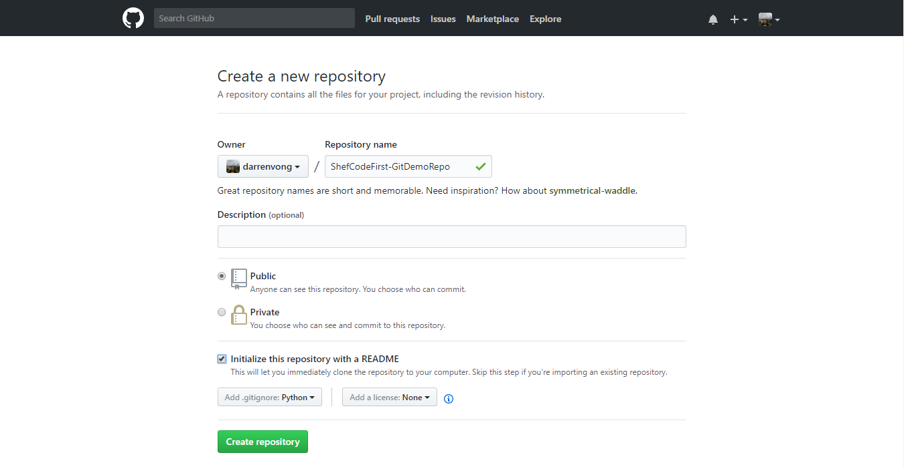

# Using Git with GitKraken

### Basic Outline
- [Introduction - staying organised with your project](#a-few-words-about-organisation)
- [Creating a new repository](#creating-a-new-git-repository)
  - [On GitHub](#creating-a-new-git-repository)
  - [Cloning it locally to laptop](#cloning-your-repository-to-your-laptop)
- [Setting up the repository](#setting-up-the-repository)
- Branches
  - Pull requests
- Merge conflicts

### A few words about organisation...
In this guide, we will go through the basics of working with Git using GitKraken as introduced in class.
Before you make a new repository, there's one thing I want to emphasise:

> Make sure you are **organised** with **where** you save your code files! Otherwise, Git will have trouble
> working out which folders and files are supposed to be part of your Flask code project!

The best way to stay organised is when you are creating a new project, **make a new folder** somewhere that's
easy to find and save your code/other related files in there. Once you've done that, make sure you keep that
folder **"clean"** - i.e. **don't** save other files/folders in there that are unrelated to the project!

Another tip for staying organised is **close the other tabs** in your editor when you have files with the same
file name opened. Most of the time, this will save you from the headache of
*"Why is my code not working even when I **know** I've fixed it?!!"*, as the chances are, you've probably been
fixing a **different copy** of the code from the one you're running on the command line.

### Creating a new Git repository
As mentioned in session 3, a Git repository is a project where all of your app files (Python code, images,
CSS stylesheets etc.) are, either online on GitHub or locally on your laptop.

1. Open your browser and log into your GitHub account at [http://github.com/login](http://github.com/login).

2. Once you've signed in, you should see something like the following near the top of your dashboard:

3. Click on the "+" icon near the top right of the dashboard, then "New Repository" on the dropdown revealed
as shown in the screenshot above. This should then take you to the following screen:

4. Give your repository a name under "Repository name", and give the project a description if you want.

5. Leave the repository as "Public", and make sure you tick checkbox next to "Initialize this repository
with a README".

6. Change the dropdown menu for "Add .gitignore" to **Python**. This is a handy file made by the people
at GitHub which will deal with common file patterns that you should not be saving (committing) to the
repository.

7. Click the green "Create Repository" button to complete the process. Great - now you have a Git repository
for your project!

### Cloning your repository to your laptop
Now that you have created your repository on GitHub, let's begin working on it. Before you can do that, you
need to have a local copy of it on your laptop - we will be using GitKraken to do this.

1. Open the GitKraken desktop application, then click on the folder icon  on the top left of the application.

2. On the "Repository Management" dialog that have just popped up, click on "Clone" in the first column and "GitHub.com" in
the second column. In the third column, click on the blue "Browse" button and browse to the folder I advised you to create
for this project (I called mine `ShefCodeFirstPython`). A reminder that there should be **nothing else** in this folder...

3. Type in the repository name you have given on GitHub next to the "Repository to clone" search box (in my case, I
called it `ShefCodeFirst-GitDemoRepo`).

4. Click the "Clone the repo!" green button to get a local copy of the repository.

5. Once GitKraken has finished copying the repository to your laptop, you should see a blue status bar near the top
of the application with the message `"Successfully cloned repo <repo-name>"`, where `<repo-name>` will show the
repository name you've given earlier. Click on the green "Open Now" button to open it in GitKraken.

Awesome - you have now a local copy of the repository that you can work on!

### Setting up the repository
Now that you have a local copy of the repository that you can work with, it's time to set it up so that it has all
the core files and folder structure that a Flask project requires.
