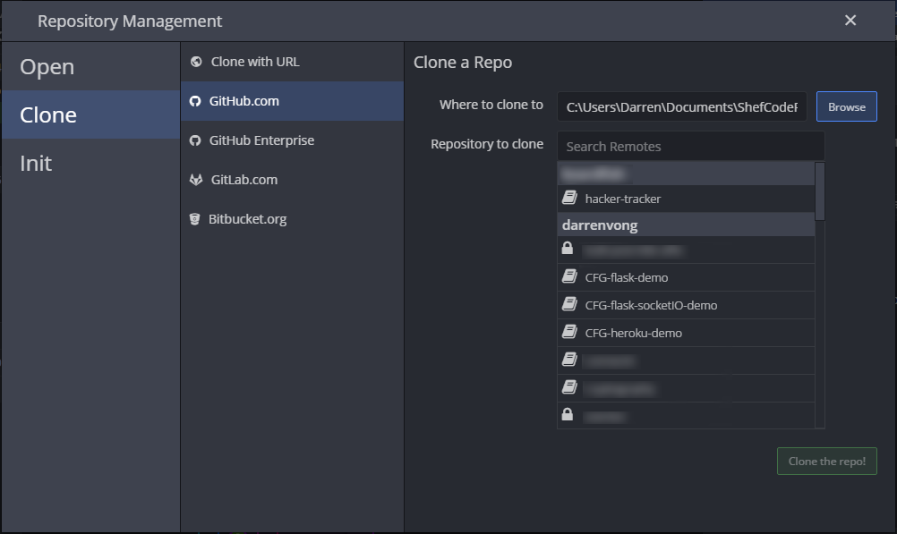
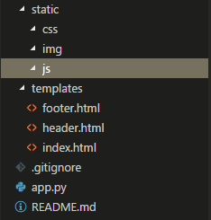
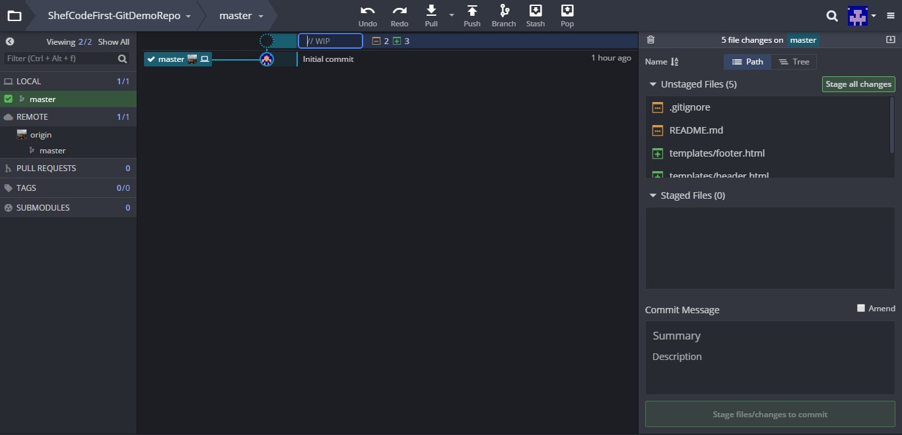
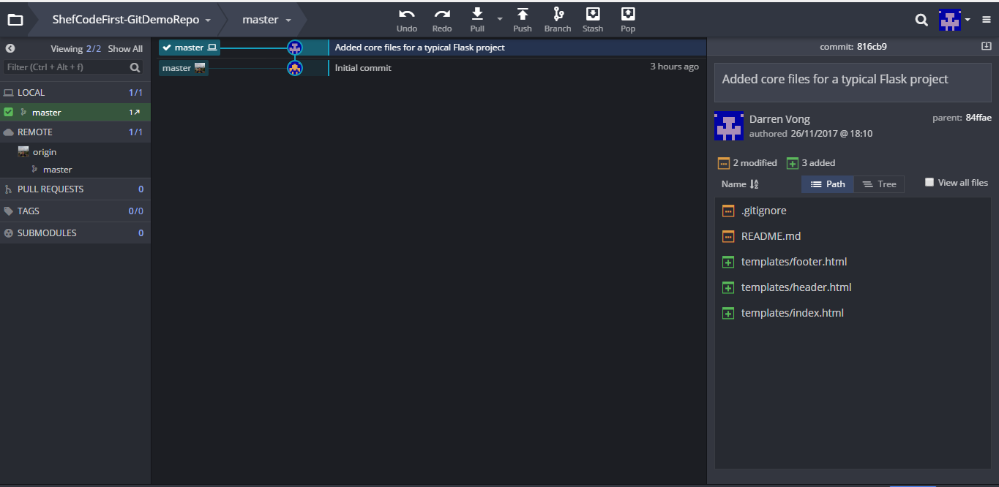

# Using Git with GitKraken

### Basic Outline
- [Introduction - staying organised with your project](#a-few-words-about-organisation)
- [Creating a new repository](#creating-a-new-git-repository)
  - [On GitHub](#creating-a-new-git-repository)
  - [Cloning it locally to laptop](#cloning-your-repository-to-your-laptop)
- [Setting up the repository](#setting-up-the-repository)
- Branches
  - Pull requests
- Merge conflicts

### A few words about organisation...
In this guide, we will go through the basics of working with Git using GitKraken as introduced in class.
Before you make a new repository, there's one thing I want to emphasise:

> Make sure you are **organised** with **where** you save your code files! Otherwise, Git will have trouble
> working out which folders and files are supposed to be part of your Flask code project!

The best way to stay organised is when you are creating a new project, **make a new folder** somewhere that's
easy to find and save your code/other related files in there. Once you've done that, make sure you keep that
folder **"clean"** - i.e. **don't** save other files/folders in there that are unrelated to the project!

Another tip for staying organised is **close the other tabs** in your editor when you have files with the same
file name opened. Most of the time, this will save you from the headache of
*"Why is my code not working even when I **know** I've fixed it?!!"*, as the chances are, you've probably been
fixing a **different copy** of the code from the one you're running on the command line.

### Creating a new Git repository
As mentioned in session 3, a Git repository is a project where all of your app files (Python code, images,
CSS stylesheets etc.) are, either online on GitHub or locally on your laptop.

1. Open your browser and log into your GitHub account at [http://github.com/login](http://github.com/login).

2. Once you've signed in, you should see something like the following near the top of your dashboard:

3. Click on the "+" icon near the top right of the dashboard, then "New Repository" on the dropdown revealed
as shown in the screenshot above. This should then take you to the following screen:

4. Give your repository a name under "Repository name", and give the project a description if you want.

5. Leave the repository as "Public", and make sure you tick checkbox next to "Initialize this repository
with a README".

6. Change the dropdown menu for "Add .gitignore" to **Python**. This is a handy file made by the people
at GitHub which will deal with common file patterns that you should not be saving (committing) to the
repository.

7. Click the green "Create Repository" button to complete the process. Great - now you have a Git repository
for your project!

### Cloning your repository to your laptop
Now that you have created your repository on GitHub, let's begin working on it. Before you can do that, you
need to have a local copy of it on your laptop - we will be using GitKraken to do this.

1. Open the GitKraken desktop application, then click on the folder icon 
on the top left of the application.

2. On the "Repository Management" dialog that have just popped up, click on "Clone" in the first column and "GitHub.com" in
the second column. In the third column, click on the blue "Browse" button and browse to the folder I advised you to create
for this project (I called mine `ShefCodeFirstPython`). A reminder that there should be **nothing else** in this folder...

3. Type in the repository name you have given on GitHub next to the "Repository to clone" search box (in my case, I
called it `ShefCodeFirst-GitDemoRepo`).

4. Click the "Clone the repo!" green button to get a local copy of the repository.

5. Once GitKraken has finished copying the repository to your laptop, you should see a blue status bar near the top
of the application with the message `"Successfully cloned repo <repo-name>"`, where `<repo-name>` will show the
repository name you've given earlier. Click on the green "Open Now" button to open it in GitKraken.

### Setting up the repository
Now that you have a local copy of the repository that you can work with, it's time to set it up so that it has all
the core files and folder structure that a Flask project requires.

As mentioned in the Flask sessions, inside the root (folder) of the repository, it should look roughly
like the following screenshot:

Go ahead and create those files and folders following the structure outlined above!
To save you from typing out all of the code from scratch, you are welcomed to copy and paste those I have made [in this repo](https://github.com/darrenvong/ShefCodeFirst-GitDemoRepo) in the process of writing this guide to create the required files.

Once you have done that, go back to GitKraken. If you still have your repository opened there, it should look
something like this:

Let's go through the **important** things that you can see on this screen.
#### Toolbar near the top
- "Undo" and "Redo" are fairly self explanatory.
- "Pull" is where you can update your repository with the changes made on GitHub's copy of your repository.
- "Push" does the opposite - it lets you send any changes you made in the local copy of the repository back
to the GitHub's copy.
- "Branch" lets you create a new branch up to the current version of the repository.
- Don't worry too much about "Stash" and "Pop" for now.

#### Left column
- We can see all the **branches** that this repository have, both locally (under "LOCAL")
and on GitHub (under "REMOTE"). Any "pull requests" for this repository can also be seen here.
- As this is a new repository, we have only one branch named "master", the default branch created whenever
you make a new repository on GitHub.
- A **remote** is what Git used to synchronise changes between the local and GitHub's copy of your repository.
You **push** updates to GitHub and **pull** in content from GitHub to update the local copy
of your repository on your laptop.
- A **branch** is a copy of the repository **up to the version** (number of commits) where it was created.
- A **commit** is a collection of changes made to the files in the repository. Think of it as similar to each time you press
"Save" in Microsoft Word to prevent potential losses on the progress you made towards your essay/report.
- A **pull request** is a request, either made by you or your teammate, to include changes they have made into
the repository.

#### Middle column
- A tree view of all the commits in the repository, as well as the badge(s)
(  ) labelled with the branch name indicating the version a branch is currently on.

#### Right column
- We can see which files have been changed since the last commit, and whether those files have been "staged" or not.
- By default, Git won't track and save changed files unless it has been explicitly instructed to do so (by staging it).
  - This can be useful when you have made changes to several files, but you only want to save some files in a new
  version since you haven't finished making changes to the other files.
- Under the "Commit Message" box is where you write a message for the commit.

Phew! Now that we have some understanding of what everything does, let's commit the files and folders we have created
and push them back to the repository on GitHub.

To do that, either hover over each file under "Unstaged Files" then click the green "Stage File" button, or if you
want to save all new and changed files, click the green "Stage all changes" button to add (stage) them all to
the "Staged Files" area.

Write a brief, descriptive message saying what changes you have made since the last commit, then click the green button
which should now read "Commit changes to x files", where x is the number of files you've staged.

The middle column should now be updated with a new commit on top of the initial commit as follows:

You may have noticed now that there are two badges shown next to the commit graph, where
 is above (ahead of) .
This is because when you've completed a commit, the changes to the repository only happens locally on your laptop.

So, to update the online ("remote") copy of repo on GitHub, you have to push the changes. To do this, simply click
the "Push" button on the toolbar at the top of the screen!

### Creating a new branch
When working in a team towards the same repository, where you might be building a specific feature for the project,
it's better to work on a copy of the repository so you won't break what's working currently already. This should always
be the `master` branch.

To create a branch from the current version of the repository, click the "Branch" button on the top toolbar,
then give the new branch a short descriptive name of the feature you'll be working on in the text field that
just covered the badge in the middle column. In my case, since I will be adding in some CSS for the app, I'll call this new
branch `styling`.

Once you are done, the badge next to your latest commit should look like this 
and the branches under "LOCAL" should be updated to look like this:

Once you've committed your new features in your branch (in my example, a CSS stylesheet), before you push your update to
GitHub, you may see a blue status bar asking you "What remote/branch should "styling" push to and pull from?".
Simply use the default option and press "Sumbit" to complete the push.

### Creating a pull request
The easiest way to create a pull request is to drag the branch you are on (the `styling` badge
in my case) to the `master` branch/badge, to bring up the context menu that looks like the following:

In the context menu, click "Start a pull request to `origin/master` from `origin/<branch-name>`" where `<branch-name>`
is the name you've given your branch (again, `<branch-name>` = `styling` in my case). The following dialog should then
appear:

Give the pull request a description if you want if the title does not provide enough details about your changes. Click
the green "Create Pull Request" button to make the pull request on GitHub.

### Resolving merge conflicts
Chances are, as you work on your project, your teammate will make different changes to the same file. When this happens
and both of you are trying to commit the same file back to `master` from your branches, this causes what's known as
a **merge conflict**.

Luckily, GitKraken has a fairly simple editor to help you resolve merge conflicts, which looks like the following:

To resolve the conflict, you can choose to include the changes from either A or B (or both!) and the resultant
file will appear in the "Output" editor in the lower half of the screen. If you don't like the changes from either A or
B on its own or when they are put together, you can also add in the changes you want directly in the "Output" editor, as
shown in the screenshot above (in line 11 in this example).

Click the green "Save" button to complete the merge conflict resolution.
